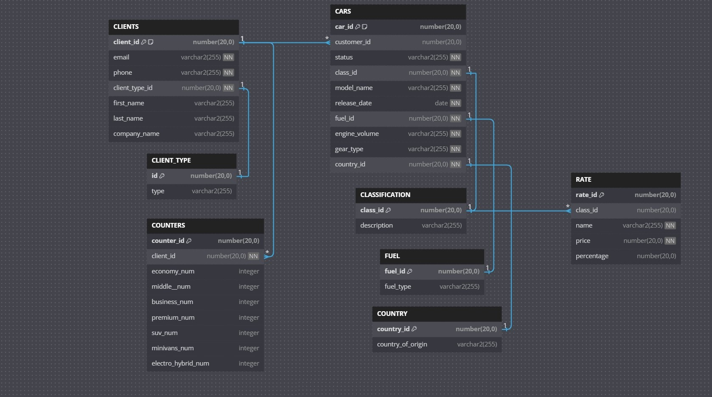

# 'CAR RENTAL' Pet Project

Basic **${\textsf{\color{red}BackEnd}}$** implementation of Car Rental System, representing DataBase model and the general logic of the system.

***

## About the Pet Project
This project represents a simple business flow implementation during the car rental. Current project is developed with the following simple business cycle:
1. Customer creation, including validation of all mandatory parameters;
2. List all _car_id_ available for rental based on the car's classification;
3. Assign the car to client:
   * implemented validation of appropriate _{car_id | client_id}_ presence;
   * implemented validation by _car_id_ availability to evade discrepancies;
   * resulting operation should assign _client_id_ to appropriate _car_id_, changing the _car_id_ status;
4. Increase counters for _client_id_ with appropriate _car_id_ classification if it is assigned;
5. Return the final bill for a customer with assigned cars:
   * bill includes _{Daily, Weekly, Monthly}_ payment category periods;
   * bill includes mortgage percentage calculations for payment category periods;

_Documentation:_ [pet_project_requirements](documentation/pet_project.pdf)

***

## Entity Relational Diagram / Data Base Structure

_Documentation:_ [pet_project_EER](documentation/pet_project_EER.pdf)

~~~~
Table CLIENTS {
  client_id number(20,0) [primary key, note: 'customer unique id']
  email varchar2(255) [not null]
  phone varchar2(255) [not null]
  client_type_id number(20,0) [not null]
  first_name varchar2(255)
  last_name varchar2(255)
  company_name varchar2(255)
}

Table CLIENT_TYPE {
  id number(20,0) [primary key]
  type varchar2(255)
}

Table COUNTERS {
  counter_id number(20,0) [primary key]
  client_id number(20,0) [not null]
  economy_num integer
  middle__num integer
  business_num integer
  premium_num integer
  suv_num integer
  minivans_num integer
  electro_hybrid_num integer
}

Table CARS {
  car_id number(20,0) [primary key, note: 'car unique id']
  customer_id number(20,0)
  status varchar2(255) [not null]
  class_id number(20,0) [not null]
  model_name varchar2(255) [not null]
  release_date date [not null]
  fuel_id number(20,0) [not null] 
  engine_volume varchar2(255) [not null]
  gear_type varchar2(255) [not null]
  country_id number(20,0) [not null]
}

Table CLASSIFICATION {
  class_id number(20,0)  [primary key]
  description varchar2(255)

}

Table RATE {
  rate_id number(20,0) [primary key]
  class_id number(20,0)
  name varchar2(255) [not null]
  price number(20,0) [not null]
  percentage number(20,0)
}

Table FUEL {
  fuel_id number(20,0) [primary key]
  fuel_type varchar2(255)
}

Table COUNTRY {
  country_id number(20,0)  [primary key]
  country_of_origin varchar2(255)
}

Ref: CLIENTS.client_id < CARS.customer_id //one-to-many
Ref: CLIENTS.client_type_id - CLIENT_TYPE.id //one-to-one
Ref: CLIENTS.client_id < COUNTERS.client_id //one-to-many
Ref: CARS.class_id - CLASSIFICATION.class_id //one-to-one
Ref: CARS.fuel_id - FUEL.fuel_id //one-to-one
Ref: CARS.country_id - COUNTRY.country_id //one-to-one
Ref: CLASSIFICATION.class_id < RATE.class_id //many-to-one
~~~~

***

## REST API implemented in Pet Project:

**${\textsf{\color{fuchsia}CLIENTS}}$** model:

1. _'saveClient'_ API creates the client:

|               API  	                |           HTTP Command 	            |     URL      |
|:-----------------------------------:|:-----------------------------------:|:------------:|
| ${\textsf{\color{blue}saveClient}}$  	 | ${\textsf{\color{yellow}POST}}$   	 | /api/clients |

Request Example

~~~
{
    "firstName" : "Elaine C.",
    "lastName" : "Torres",
    "email" : "ElaineCTorres@gmail.com",
    "phone" : "+38(068)26-125-18",
    "clientType" : {"clientType" : 1}
}
~~~

Response Example

~~~
Status: 201 Created
{
  "client_id": 1727298103,
  "email": "ElaineCTorres@gmail.com",
  "phone": "+38(068)26-125-18",
  "clientType": {
    "clientType": 1,
    "type": null
  },
  "firstName": "Elaine C.",
  "lastName": "Torres",
  "companyName": null
}
~~~

2. _'getAllClients'_ API returns the list of all clients with all clients' data:

|                      API  	                       |          HTTP Command 	           |     URL      |
|:-------------------------------------------------:|:---------------------------------:|:------------:|
| ${\textsf{\color{blue}getAllClients}}$   	 | ${\textsf{\color{green}GET}}$   	 | /api/clients |

Response Example

~~~
Status: 200 OK
[
	{
		"client_id": 1727298000,
		"email": "Tania_Olson-Reichert@gmail.com",
		"phone": "+380(0542)62-43-22",
		"clientType": {
			"clientType": 1,
			"type": "Residential"
		},
		"firstName": "Tania",
		"lastName": "Olson-Reichert",
		"companyName": null
	},
   {
	    "client_id": 1727298005,
	    "email": "lifecell_ukraine@gmail.com",
	    "phone": "+380(0635)44-31-11",
	    "clientType": {
		    "clientType": 2,
		    "type": "Company"
	    },
	    "firstName": null,
	    "lastName": null,
	     "companyName": "LIFECELL_LLC"
   }
]
~~~

3. _'getClientByClientId'_ API returns the specific client data:

|                         API  	                          |          HTTP Command 	           |      URL      |
|:-------------------------------------------------------:|:---------------------------------:|:-------------:|
| ${\textsf{\color{blue}getClientByClientId}}$    	 | ${\textsf{\color{green}GET}}$   	 | /api/clients/{client_id} |

Response Example

~~~
Status: 200 OK
{
  "client_id": 1727298020,
  "email": "TimothyJDavis@dayrep.com",
  "phone": "+380(0552)22-00-69",
  "clientType": {
    "clientType": 1,
    "type": "Residential"
  },
  "firstName": "Timothy J.",
  "lastName": "Davis",
  "companyName": null
}
~~~

**${\textsf{\color{fuchsia}CARS}}$** model:
1. _'getAllCars'_ API returns the list of all cars with appropriate data:

|                 API  	                  |          HTTP Command 	           |    URL    |
|:---------------------------------------:|:---------------------------------:|:---------:|
| ${\textsf{\color{blue}getAllCars}}$   	 | ${\textsf{\color{green}GET}}$   	 | /api/cars |

Response Example

~~~
Status: 200 OK
[
	{
		"car_id": 1,
		"client_id": {
			"client_id": 1727298000,
			"email": "Tania_Olson-Reichert@gmail.com",
			"phone": "+380(0542)62-43-22",
			"clientType": {
				"clientType": 1,
				"type": "Residential"
			},
			"firstName": "Tania",
			"lastName": "Olson-Reichert",
			"companyName": null
		},
		"status": "Not Available",
		"class_id": {
			"class_id": 4,
			"description": "Premium Class"
		},
		"model_name": "Mercedes Benz E220d",
		"release_date": "2016-08-31T21:00:00.000+00:00",
		"fuel_id": {
			"fuel_id": 6,
			"fuel_type": "Diesel"
		},
		"engine_volume": "2.01",
		"gear_type": "Automatic",
		"country_id": {
			"country_id": 5,
			"country_of_origin": "Germany"
		}
	},
	{
		"car_id": 2,
		"client_id": {
			"client_id": 1727298000,
			"email": "Tania_Olson-Reichert@gmail.com",
			"phone": "+380(0542)62-43-22",
			"clientType": {
				"clientType": 1,
				"type": "Residential"
			},
			"firstName": "Tania",
			"lastName": "Olson-Reichert",
			"companyName": null
		},
		"status": "Not Available",
		"class_id": {
			"class_id": 5,
			"description": "SUV Class"
		},
		"model_name": "Mercedes-Benz GLE",
		"release_date": "2015-08-31T21:00:00.000+00:00",
		"fuel_id": {
			"fuel_id": 1,
			"fuel_type": "Gasoline"
		},
		"engine_volume": "3.01",
		"gear_type": "Automatic",
		"country_id": {
			"country_id": 5,
			"country_of_origin": "Germany"
		}
	}
]
~~~

2. _'getCarByCarId'_ API returns the data for a specific _car_id_:

|                      API  	                       |           HTTP Command 	           |          URL           |
|:-------------------------------------------------:|:----------------------------------:|:----------------------:|
| ${\textsf{\color{blue}getCarByCarId}}$   	 | ${\textsf{\color{green}GET}}$    	 | /api/cars/car/{car_id} |

Response Example

~~~
Status: 200 OK
{
  "car_id": 13,
  "client_id": null,
  "status": "Available",
  "class_id": {
    "class_id": 2,
    "description": "Middle Class"
  },
  "model_name": "Volkswagen Golf",
  "release_date": "2020-08-31T21:00:00.000+00:00",
  "fuel_id": {
    "fuel_id": 6,
    "fuel_type": "Diesel"
  },
  "engine_volume": "2.0 turbo",
  "gear_type": "Automatic",
  "country_id": {
    "country_id": 5,
    "country_of_origin": "Germany"
  }
}
~~~

3. _'getCarsByCustomerId'_ API returns the list of cars data for a specific _client_id_:

|                         API  	                          |          HTTP Command 	          |              URL               |
|:-------------------------------------------------------:|:--------------------------------:|:------------------------------:|
| ${\textsf{\color{blue}getCarsByCustomerId}}$   	 | ${\textsf{\color{green}GET}}$  	 | /api/cars/customer/{client_id} |

Response Example

~~~
Status: 200 OK
[
	{
		"car_id": 1,
		"client_id": {
			"client_id": 1727298000,
			"email": "Tania_Olson-Reichert@gmail.com",
			"phone": "+380(0542)62-43-22",
			"clientType": {
				"clientType": 1,
				"type": "Residential"
			},
			"firstName": "Tania",
			"lastName": "Olson-Reichert",
			"companyName": null
		},
		"status": "Not Available",
		"class_id": {
			"class_id": 4,
			"description": "Premium"
		},
		"model_name": "Mercedes Benz E220d",
		"release_date": "2016-08-31T21:00:00.000+00:00",
		"fuel_id": {
			"fuel_id": 6,
			"fuel_type": "Diesel"
		},
		"engine_volume": "2.01",
		"gear_type": "Automatic",
		"country_id": {
			"country_id": 5,
			"country_of_origin": "Germany"
		}
	},
	{
		"car_id": 2,
		"client_id": {
			"client_id": 1727298000,
			"email": "Tania_Olson-Reichert@gmail.com",
			"phone": "+380(0542)62-43-22",
			"clientType": {
				"clientType": 1,
				"type": "Residential"
			},
			"firstName": "Tania",
			"lastName": "Olson-Reichert",
			"companyName": null
		},
		"status": "Not Available",
		"class_id": {
			"class_id": 5,
			"description": "SUV"
		},
		"model_name": "Mercedes-Benz GLE",
		"release_date": "2015-08-31T21:00:00.000+00:00",
		"fuel_id": {
			"fuel_id": 1,
			"fuel_type": "Gasoline"
		},
		"engine_volume": "3.01",
		"gear_type": "Automatic",
		"country_id": {
			"country_id": 5,
			"country_of_origin": "Germany"
		}
	},
	{
		"car_id": 3,
		"client_id": {
			"client_id": 1727298000,
			"email": "Tania_Olson-Reichert@gmail.com",
			"phone": "+380(0542)62-43-22",
			"clientType": {
				"clientType": 1,
				"type": "Residential"
			},
			"firstName": "Tania",
			"lastName": "Olson-Reichert",
			"companyName": null
		},
		"status": "Not Available",
		"class_id": {
			"class_id": 7,
			"description": "Electro_Hybrid"
		},
		"model_name": "Honda Accord Hybrid",
		"release_date": "2024-08-31T21:00:00.000+00:00",
		"fuel_id": {
			"fuel_id": 3,
			"fuel_type": "Hybrid (HEV)"
		},
		"engine_volume": "2.0 turbo",
		"gear_type": "Automatic",
		"country_id": {
			"country_id": 3,
			"country_of_origin": "Japan"
		}
	}
]
~~~

4. _'getAvailableCarsByClassId'_ API returns the list of 'Avaialable' cars within specific classification:

|                            API  	                             |          HTTP Command 	           |                 URL                 |
|:-------------------------------------------------------------:|:---------------------------------:|:-----------------------------------:|
| ${\textsf{\color{blue}getAvailableCarsByClassId}}$   	 | ${\textsf{\color{green}GET}}$   	 | /api/cars/classification/{class_id} |

Response Example

~~~
Status: 200 OK
[
	{
		"car_id": 7,
		"client_id": null,
		"status": "Available",
		"class_id": {
			"class_id": 1,
			"description": "Economy"
		},
		"model_name": "KIA Forte",
		"release_date": "2013-08-31T21:00:00.000+00:00",
		"fuel_id": {
			"fuel_id": 1,
			"fuel_type": "Gasoline"
		},
		"engine_volume": "2.0",
		"gear_type": "Automatic",
		"country_id": {
			"country_id": 4,
			"country_of_origin": "South Korea"
		}
	},
	{
		"car_id": 8,
		"client_id": null,
		"status": "Available",
		"class_id": {
			"class_id": 1,
			"description": "Economy"
		},
		"model_name": "Mitsubishi Outlander Sport (ASX)",
		"release_date": "2010-08-31T21:00:00.000+00:00",
		"fuel_id": {
			"fuel_id": 1,
			"fuel_type": "Gasoline"
		},
		"engine_volume": "2.0",
		"gear_type": "Automatic",
		"country_id": {
			"country_id": 3,
			"country_of_origin": "Japan"
		}
	}
]
~~~

5. _'saveCar'_ API creates the car:

|                   API  	                    |           HTTP Command 	           |    URL    |
|:-------------------------------------------:|:----------------------------------:|:---------:|
| ${\textsf{\color{blue}saveCar}}$   	 | ${\textsf{\color{yellow}POST}}$   	 | /api/cars |

Request Example

~~~
{
    "status" : "Available",
    "class_id" : {"class_id" : 4},
    "model_name" : "Audi A6 QUATTRO",
    "release_date" : "2024-05-01",
    "fuel_id" : {"fuel_id" : 1},
    "engine_volume" : "3.0",
    "gear_type" : "Automatic",
    "country_id" : {"country_id" : 5}
}
~~~

Response Example

~~~
Status: 201 Created
{
  "car_id": 81,
  "client_id": null,
  "status": "Available",
  "class_id": {
    "class_id": 4,
    "description": null
  },
  "model_name": "Maserati GranTurismo AWD Modena",
  "release_date": "2024-05-01T00:00:00.000+00:00",
  "fuel_id": {
    "fuel_id": 1,
    "fuel_type": null
  },
  "engine_volume": "3.0",
  "gear_type": "Automatic",
  "country_id": {
    "country_id": 11,
    "country_of_origin": null
  }
}
~~~

6. _'assignCarToClient'_ API assigns the _car_id_ to the _client_id_:

|                    API  	                     |           HTTP Command 	           |                   URL                    |
|:---------------------------------------------:|:----------------------------------:|:----------------------------------------:|
|${\textsf{\color{blue}assignCarToClient}}$   	 | ${\textsf{\color{yellow}POST}}$   	 | /api/cars/assign/{car_id}/to/{client_id} |

Response Example

~~~
Status: 200 OK
{
  "car_id": 7,
  "client_id": {
    "client_id": 1727298045,
    "email": "BrunoGimoraens@gmail.com",
    "phone": "+38(063)99-26-76",
    "clientType": {
      "clientType": 1,
      "type": "Residential"
    },
    "firstName": "Bruno",
    "lastName": "Gimoraens",
    "companyName": null
  },
  "status": "Not Available",
  "class_id": {
    "class_id": 1,
    "description": "Economy"
  },
  "model_name": "KIA Forte",
  "release_date": "2013-08-31T21:00:00.000+00:00",
  "fuel_id": {
    "fuel_id": 1,
    "fuel_type": "Gasoline"
  },
  "engine_volume": "2.0",
  "gear_type": "Automatic",
  "country_id": {
    "country_id": 4,
    "country_of_origin": "South Korea"
  }
}
~~~

7. _'deassignCarFromClient'_ API de-assigns the _car_id_ from the _client_id_:

|                    API  	                     |           HTTP Command 	           |                     URL                      |
|:---------------------------------------------:|:----------------------------------:|:--------------------------------------------:|
|${\textsf{\color{blue}deassignCarFromClient}}$   	 | ${\textsf{\color{yellow}POST}}$   	 | /api/cars/deassign/{car_id}/from/{client_id} |

Response Example

~~~
Status: 200 OK
{
  "car_id": 7,
  "client_id": null,
  "status": "Available",
  "class_id": {
    "class_id": 1,
    "description": "Economy"
  },
  "model_name": "KIA Forte",
  "release_date": "2013-08-31T21:00:00.000+00:00",
  "fuel_id": {
    "fuel_id": 1,
    "fuel_type": "Gasoline"
  },
  "engine_volume": "2.0",
  "gear_type": "Automatic",
  "country_id": {
    "country_id": 4,
    "country_of_origin": "South Korea"
  }
}
~~~

**${\textsf{\color{fuchsia}CLASSIFICATION}}$** model: model:
1. _'getAllClassifications'_ API returns all cars classification:

|                   API  	                    |           HTTP Command 	           |         URL          |
|:-------------------------------------------:|:----------------------------------:|:--------------------:|
| ${\textsf{\color{blue}getAllClassifications}}$   	 | ${\textsf{\color{green}GET}}$    	 | /api/classifications |

Response Example

~~~
Status: 200 OK
[
	{
		"class_id": 1,
		"description": "Economy Class"
	},
	{
		"class_id": 2,
		"description": "Middle Class"
	},
	{
		"class_id": 3,
		"description": "Business Class"
	},
	{
		"class_id": 4,
		"description": "Premium Class"
	},
	{
		"class_id": 5,
		"description": "SUV Class"
	},
	{
		"class_id": 6,
		"description": "Minivan Class"
	},
	{
		"class_id": 7,
		"description": "Electric_Hybrid Class"
	}
]
~~~

**${\textsf{\color{fuchsia}RATE}}$** model:
1. _'calculateTotalForClient'_ API returns the final bill calculation based on the current rates and customers cars with appropriate classification:

|                            API  	                             |          HTTP Command 	           |             URL              |
|:-------------------------------------------------------------:|:---------------------------------:|:----------------------------:|
| ${\textsf{\color{blue}calculateTotalForClient}}$   	 | ${\textsf{\color{green}GET}}$   	 | /api/rates/total/{client_id} |

Response Example

~~~
Status: 200 OK
{
  "Daily": {
    "total": 260,
    "mortgage": 126
  },
  "Monthly": {
    "total": 163,
    "mortgage": 47
  },
  "Weekly": {
    "total": 225,
    "mortgage": 94
  }
}
~~~

***

## Used Tools

- Java 21
- Spring Boot 3.3.4
  * Spring Boot JPA
  * Spring Boot Thymeleaf
  * Spring Web MVC
- Oracle JDBC 11
- Maven 3.9.4
- Lombok
- FlywayDB